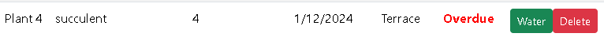

# Plant Care Dashboard

A React-based application for managing plant care schedules, including adding, editing, and tracking the status of plants.

## Screenshots

### Dashboard


### Create


### Update (water status)



### Delete


### Sort by


### Get -> Due


### Show all


### Project structure


### SWAGGER


---

## Technologies Used

- **Frontend**: React, TypeScript, Bootstrap, Axios
- **Testing**: Jest, React Testing Library
- **Build Tool**: Vite
- **Backend**: .Net, SQL Server, Entity Framework, Swagger
- **Environment Configuration**: dotenv

---

## Architecture

This project follows a **Model-View-Controller (MVC)  architecture**:
- **Model**: Represents data structures using TypeScript interfaces (e.g., Plant).
- **View**: Composed of reusable UI components like PlantTable and PlantFormModal.
- **Controller**: Handles user interactions and API calls within the Dashboard page and other components.
- **Testing**: Unit tests for key components using Jest and Testing Library.
- **State Management**: Managed via React's `useState` and `useEffect`.

---

## Setup Instructions

### 1. Clone the repository
```bash
git clone <repository-url>
cd <repository-folder>
```

### 2. Install dependencies
```bash
npm install
```

### 3. Setup environment variables
Create a `.env` file in the root directory with the following content:
```
VITE_API_BASE_URL=http://localhost:7056/api
```

### 4. Run the development server
```bash
npm run dev
```

### 5. Run tests
```bash
npm test
```

### 6. Setup Database using Entity Framework

1. **Open the backend project in Visual Studio.**
2. **Configure the database connection string:**
   - Open `appsettings.json`.
   - Update the `ConnectionStrings.DefaultConnection` value to match your SQL Server instance:
     ```json
     {
       "ConnectionStrings": {
         "DefaultConnection": "Server=localhost;Database=PlantCareDB;Trusted_Connection=True;MultipleActiveResultSets=true"
       }
     }
     ```
3. **Run migrations:**
   - Open the **Package Manager Console** in Visual Studio and run:
     ```bash
     Add-Migration InitialCreate
     Update-Database
     ```
   - This will create the `PlantCareDB` database with the necessary tables.

4. **Verify the database setup:**
   - Open SQL Server Management Studio (SSMS).
   - Check that the `PlantCareDB` database and its tables were created.

### 7. Start the backend
Run the backend API project in Visual Studio using IIS Express or Kestrel.
---

## Brief Explanation of Approach

1. **Componentization**: The application is split into modular, reusable components for scalability and easier testing.
2. **Testing Strategy**:
   - Focused on testing key components like `PlantTable` and `PlantFormModal`.
   - Mocked API requests to isolate the frontend logic.
3. **Environment Configuration**: Used Vite's `import.meta.env` for dynamic environment variable management.
4. **User Experience**: Integrated Bootstrap for responsive and visually appealing design.
5. **Error Handling**: Axios error handling ensures feedback in case of API failures.

---

## Assumptions Made

- API endpoints follow RESTful conventions and return standard JSON responses.
- Environment variables are provided via a `.env` file.
- The backend is already running at the URL specified in `VITE_API_BASE_URL`.

---

## Pertinent Notes

- To extend the functionality, simply add new React components or API endpoints as needed.
- For deployment, ensure that the `VITE_API_BASE_URL` variable in the `.env` file points to the production backend.

